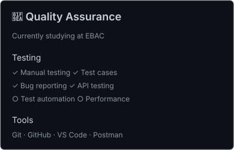
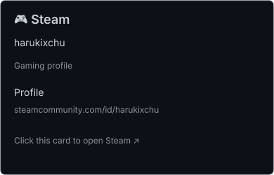

> Want to know what I'm currently working on ?\
> I'm currently studying **Quality Assurance** at [EBAC](https://ebaconline.com.br/engenheiro-de-qualidade) and building my skills in software testing.
>
> - [x] Manual testing
> - [x] Test cases and bug reporting
> - [x] API testing with Postman
> - [ ] Test automation
> - [ ] Performance testing
>
> *You can also find me on [AniList](https://anilist.co/user/danterkive/), [Spotify](https://open.spotify.com/user/p0qt2aq59igfz1ob50qc2w20p) and [Steam](https://steamcommunity.com/id/harukixchu).* 

These infographics were generated using https://github.com/lowlighter/metrics

<!-- Visuals -->
<!-- https://github.com/danterkive/danterkive/tree/master/assets -->
