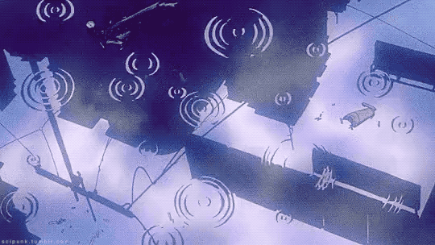

> Want to know what I'm currently working on?  
> I'm currently studying **Quality Assurance**, software testing and automation.
>
> - [x] Manual testing
> - [x] Test cases & bug reporting
> - [x] API testing with Postman
> - [ ] Test automation
> - [ ] Performance testing
>
> GitHub [@danterkive](https://github.com/danterkive) · AniList [@danterkive](https://anilist.co/user/danterkive/) · [Spotify](https://open.spotify.com/user/p0qt2aq59igfz1ob50qc2w20p) · [Steam](https://steamcommunity.com/id/harukixchu)

These infographics were generated using https://github.com/lowlighter/metrics
